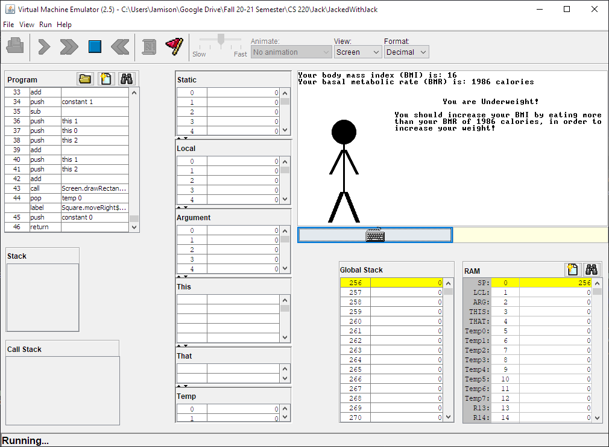
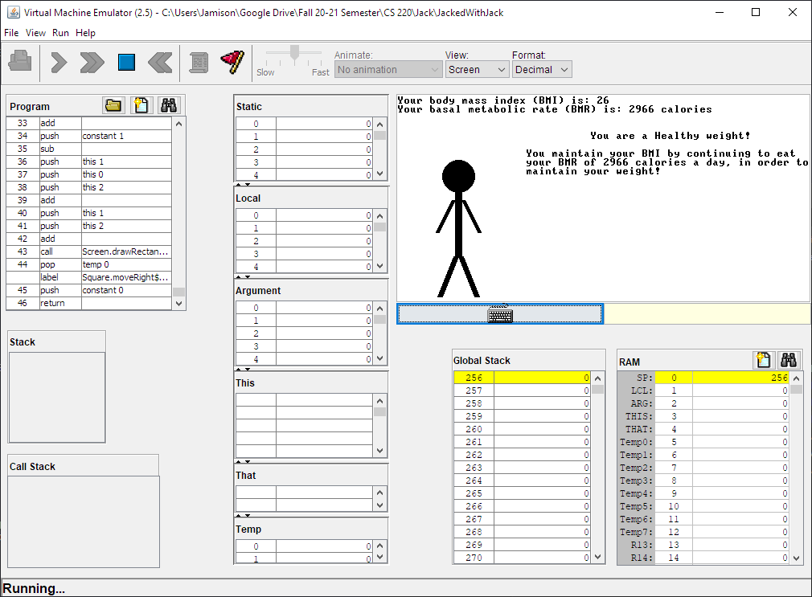
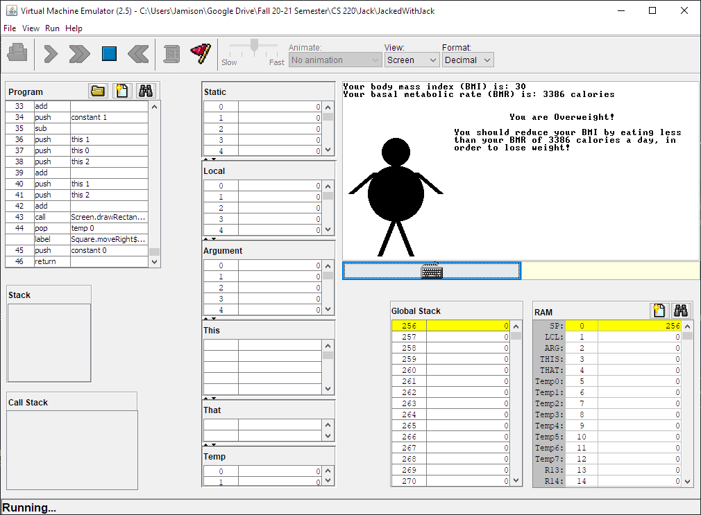

# JackedWithJack
The JackedWithJack program determines the user’s BMI, BMR, and health based on an inputted height, weight, age, sex, and activity level. It will then display the results on a screen with graphics to help the user maintain or achieve a healthy BMI based on the user’s calculated BMR.

This program was written in a custom high level language known as Jack and is a part of the Nand2Tetris suite.

  

  

  

